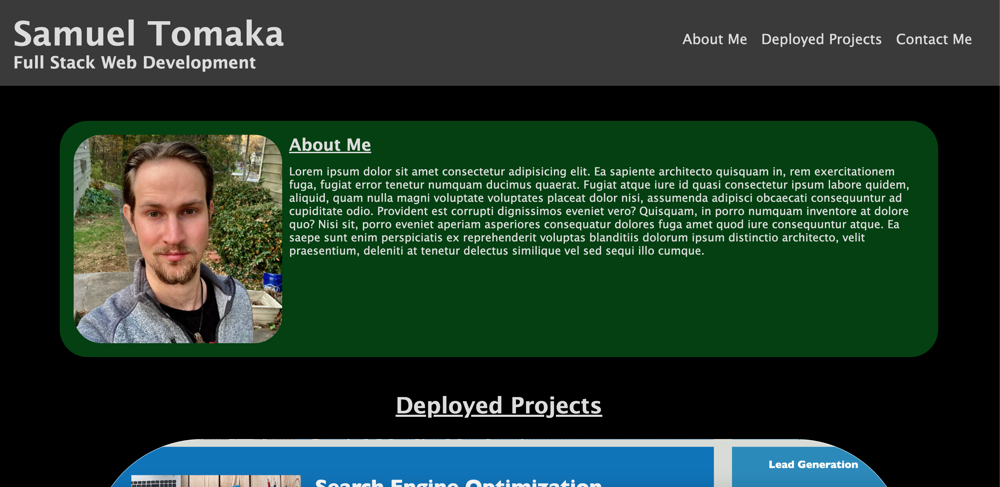
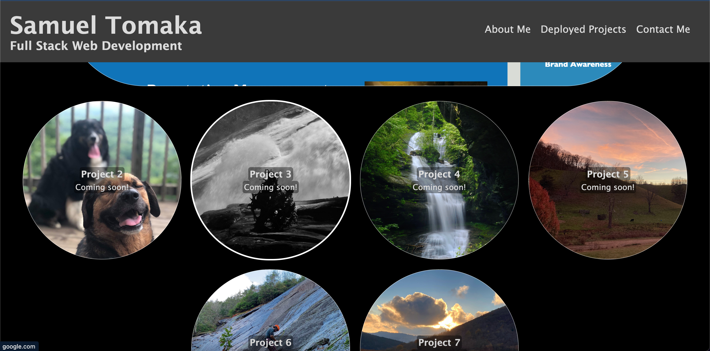

# Samuel Tomaka Web Development Portfolio

## Description

This is a scratch-made portfolio designed to house links to my deployed web-dev projects, basic info about myself and my career skills, and contact information for use by potential employers. It should also demonstrate proficiency in CSS graphic styling and responsive layout design.

## Installation

N/A

## Usage

Nav bar links provide instant navigation to a desired section, and are always visible at the top of the screen in a fixed position. These elements will conform to a narrower screen size in column form. Screenshots of various deployed projects contained overlaid text descriptions and are clickable as hyperlinks to each project. These elements also automatically conform to differing screen sizes. "Email Me" link opens users email client with a blank draft addressed to me.

## Credits

N/A, original code.

## License

Refer to license in the repo.
